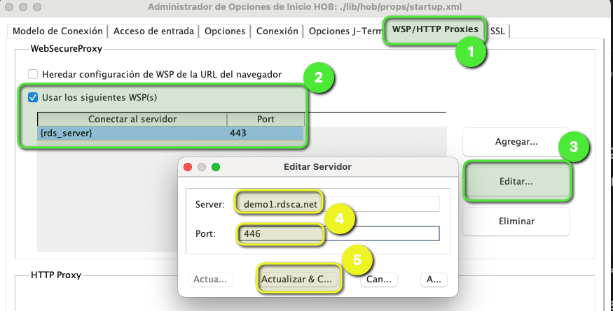
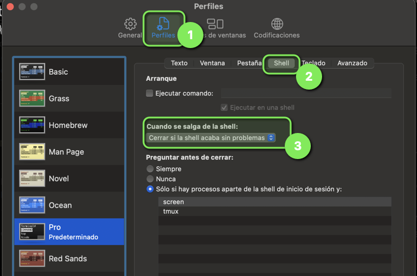
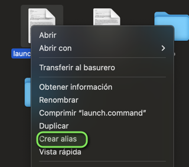
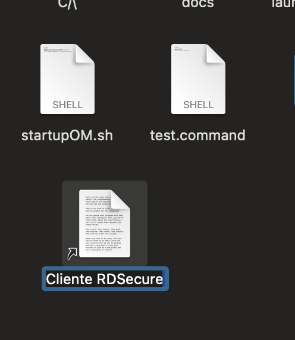

# Mango Launcher para Mac

Esta es la primera versión del script de MangoLauncher, la cual lanza el cliente de RDSecure.

## Instalación

- Descargar la versión más reciente desde [la liga de los releases](https://github.com/RDSecureSuit/mangoLauncher/releases)

```bash
unzip {release}.zip
cd {release}/mac
```

Establece los permisos de ejecución

```bash
chmod +x mac/startupOM.sh
chmod +x mac/launch.command
```

## Primera configuración

Una vez descomprimida la aplicación es necesario actualizar la información del servidor HOB/RDSecure

### Usando el Startup Options Manager

Abre el StartOptions Manager mediante el comando

```bash
mac/startupOM.sh
```

1. Una vez abirta la aplicación, ve a la pestaña **WSP/HTTPS Proxies**
2. En la casilla **Usar los siguientes WSP(s)** selecciona {rds_server}
3. Da click en el **botón Editar**
4. Establece la dirección del servidor RDS/HOB **SIN HTTPS://**
5. Escribe el puerto
6. Da clic en actualizar & Cerrar



## Configurar la Terminal

Abre una Terminal en Mac y presiona Command+[coma] para abrir la configuración.

1. Da clic en perfiles
2. Selecciona la pestaña Shell
3. En la opción **Cuando se salga del shell** Establece **Cerrar si el shell acaba sin problemas**
4. cierra la ventana de confguración
5. Sal de la terminal



Ahora ya tenemos todo listo para ejecutar la aplicación.

El último paso es crear un alias, para eso abre el Finder y ve a la carpeta donde descrimiste el cliente.

Da clic con el botón secundario del mouse sobre launch.command y da clic en crear Alias



Establece el nombre de Cliente RDSecure



Corta y pega dicho Alias en el escritorio
